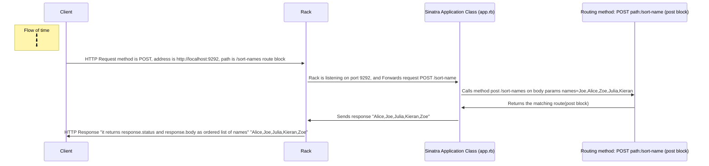

```mermaid
sequenceDiagram
  participant C as Client
  participant R as Rack
  participant A as Sinatra Application Class (app.rb)
  participant Rou as Routing method: POST path:/sort-name (post block)
  Note left of C: Flow of time <br /> ⬇ <br /> ⬇ <br /> ⬇ 
  C->>+R: HTTP Request method is POST, address is http://localhost:9292, path is /sort-names route block
  rect rgb(400, 350, 355)
  R->>+A: Rack is listening on port 9292, and Forwards request POST /sort-name
  A->>Rou: Calls method post /sort-names on body params names=Joe,Alice,Zoe,Julia,Kieran
  Rou->>A: Returns the matching route(post block)
  A->>R: Sends response "Alice,Joe,Julia,Kieran,Zoe"
  end
  R->>C: HTTP Response "it returns response.status and response.body as ordered list of names"   "Alice,Joe,Julia,Kieran,Zoe"
```

